<!--#     The TensorFlow Microcontroller Challenge    -->
   <h1>:robot: :mechanical_arm: IA para Espacios interactivos :mechanical_arm: :robot:</h1>

<!-- PROJECT LOGO -->
<br />
<p align="center">
  <a href="https://projecthub.arduino.cc/projects/">
    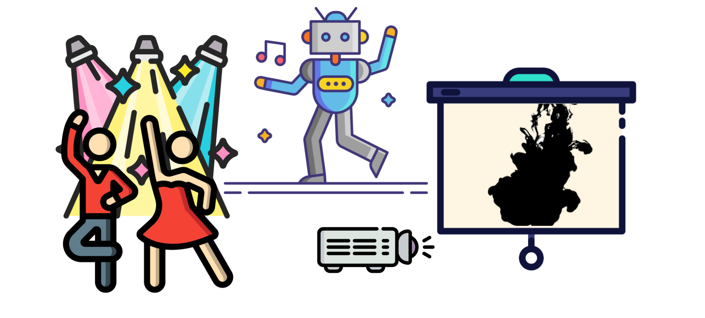
  </a>
  <br />

  
  


  <a href="https://www.linkedin.com/in/fullmakeralchemist/">
    
  </a>
  <!--<a href="https://projecthub.arduino.cc/projects/">
    
  </a>-->
   <h3 align="center">IA para Espacios interactivos proyecto final para Bootcamp de Python Avanzado</h3>
  <p align="center">
    Empoderando el Arte
    <!--<br />
    <a href="https://projecthub.arduino.cc/projects/"><strong>View the project»</strong></a>
    <br />-->
  </p>
  <p align="center">
  <!--<a href="https://projecthub.arduino.cc/projects/">
  </a>-->
  </p>
  <br />
</p>
<br />

<!-- ABOUT THE PROJECT -->
## About The Project

<!-- [](https://www.youtube.com/watch?v=3YUVTDTo-Zk) -->

Un dispositivo inteligente para identificar movimientos en un espacio interactivo y responder a estos con animaciones, retroiluminación, música y esculturas inteligentes. 
Este proyecto hace uso de un algoritmo de aprendizaje automático capaz de clasificar y detectar movimientos para identificar gestos asociados a través de un microcontrolador y un protocolo de comunicación. 
Las esculturas inteligentes, iluminación, música y proyección de video que se activan con cada gesto definido, crean una poderosa experiencia que resalta el increíble potencial de TinyML para las artes escénicas.
Esto permite que el conjunto de elementos correspondiente se reproduzca cuando se realizó el movimiento correcto porque todos estos elementos interactúan para crear una nueva experiencia. 
Esto nos permite crear instalaciones interactivas, estas esculturas utilizan una combinación de motores, sensores y otros dispositivos electrónicos para crear una experiencia inmersiva e interactiva para el espectador. 
Pueden incluir proyecciones, sonido y otros elementos sensoriales asi como mas elementos de forma escalable para crear una experiencia completa.

<!-- Content of the repository -->
## Metodología

Este proyecto está diseñado para abordar los desafíos que enfrentan los profesionales en el campo del arte, particularmente en México, donde la asistencia a lugares culturales y artisticos tiene un aforo de bajo porcentaje en la poblacion. 
Los objetivos principales del proyecto son los siguientes:

1. Crear un modelo que detecte movimientos
2. El dispositivo del modelo se conecte por algún protocolo a la Raspberry
3. Usar la Raspberry como intermediario entre el dispositivo con el modelo y los actuadores
4. Que respondan por movimiento los actuadores
5. Que sea escalable

Los pasos de la metodología utilizada son:

1. Selección de Hardware y Sensores:
- Seleccionar cuidadosamente los dispositivos de hardware, como Arduino o Raspberry Pi, según los requisitos del proyecto y las tarjetas que puedan ser compatibles.
2. Selección de protocolos de comunicación y librerías:
- Identificar las herramientas como MQTT y Open Source software como Mosquitto que sean compatibles con Arduino, Raspberry y la comunicación Bluetooth con las tarjetas Arduino Nano.
3. Desarrollo de Firmware y Configuración del Dispositivo:
- Desarrollar el prototipo de software y hardware necesario para los dispositivos seleccionados, programando la recepción y transmisión de datos desde las tarjetas cuando detecten un movimiento en específico.
4. Pruebas y Validación del Sistema:
- Realizar pruebas exhaustivas del sistema en todas las etapas, desde la adquisición de datos hasta el envío de las señales para activar el sistema.

Al seguir esta metodología, se espera que el proyecto logre su objetivo de activar los elementos que se pudieron integrar al proyecto.

### Creado con

Con cariño 💖, motivación para ayudar a otros 💪🏼 Arduino, Edge Impulse y Python 🐍, usando:

* Edge Impulse con su plataforma y su documentación
* Arduino IDE y  Hardware
* Arduino Nano Nicla SENSE ME (con Bateria)
* Arduino Nano RP 2040
* Una [Raspberry Pi 4 4GB](https://www.raspberrypi.org/) 4 
* Algún proyector con conexión HDMI 
* Arduino Opla IoT Kit
* The MQTT [Mosquitto](https://mosquitto.org/) Broker
* The [Eclipse Paho](http://eclipse.org/paho/) MQTT Python client [library](https://pypi.org/project/paho-mqtt/)
* [PubSubClient library](https://github.com/knolleary/pubsubclient/archive/master.zip) in Arduino IDE for the ESP8266 Board
* Arduino IDE
* Algún dispositivo que pueda reproducir Spotify
* Robot de Legos en esta ocasión usé un HAT de Raspberry que es compatible con Legos de motor

<!-- GETTING STARTED -->
## Getting Started

Para tener una copia local en funcionamiento, siga estos pasos:

### Prerrequisitos

Antes de descargar una copia a tu ambiente local necesitas tener o hacer los siguientes pasos. Esta es una lista de cosas que necesitas para que se ejecute el script y como instalar algunas de ellas. La primera de ellas es:

- Configurar Raspberry Pi OS para ejecutar el código
- Configurar una máquina con el IDE de Arduino y sus librerías así como los elementos necesarios para el código de la tarjeta, obtener la librería de PubSubClient para usar MQTT en Tarjetas Arduino.
- Configurar el Edge Impulse CLI en Windows (Es lo que yo use) para crear tu dataset que servirá para entrenar el modelo en este caso mi modelo ya está entrenado y listo para ser usado en Arduino. En caso de querer entrenar tu propio modelo dejare los pasos pero necesitas crear una cuenta en Edge Impulse documentación de Edge Impulse.
- Setear Spotify en Raspberry PI OS para poder ejecutar comandos de Spotify developer.
- Entrenar el modelo en Edge Impulse.

Para esta sección en particular, supondré que ya tienes una Raspberry Pi configurada. Si no, tengo una guía en Medium para hacerlo [Getting started on Raspberry Pi 4](https://fullmakeralchemist.medium.com/setting-up-your-raspberry-pi-4-wireless-f51c16937d1e). 
Tambien necesitas tener git instalado en caso de que no te dejo una guia que hice en [Medium](https://fullmakeralchemist.medium.com/install-git-and-visual-studio-code-on-raspberry-pi-48d054fdee07) para hacerlo.
Para obtener una descripción general de la configuración de Arduino Nicla Sense ME, puede consultar la Guía de Arduino en [Getting started with Arduino Nicla Sense ME](https://docs.arduino.cc/tutorials/nicla-sense-me/getting-started/).

Antes de instalar las librerias en Raspberry Pi, ejecute las siguientes líneas de código en la terminal Raspberry Pi:

```
sudo apt update
sudo apt upgrade
```
Después de actualizar escribiremos el siguiente comando para crear un Virtual Environment:

```
python -m venv env
source/env/bin/activate
```

Para tener el VLC que puede reproducir videos en Raspberry Pi hay que ejecutar: 
```
pip install python-vlc
```

Para instalar Mosquitto Broker, ingrese los siguientes comandos. Tendrás que escribir el comando y luego introducir "Y" cuando lo solicite y presionar Enter para confirmar la instalación. Para hacer que Mosquitto se inicie automáticamente al arrancar, ingrese:

```
sudo apt install -y mosquitto mosquitto-clients
```

Luego escriba el siguiente comando, tenemos que modificar un documento que se instaló para habilitar el Broker MQTT como broker público en su red WIFI local:

```
sudo nano /etc/mosquitto/mosquitto.conf  
```

Ahora agrega las siguientes líneas al final, sin modificar el resto del documento (Ctrl+x para guardar cambios):
```
listener 1883   
allow_anonymous true   
```

Después de guardar el documento, debe reiniciar Mosquitto Broker, ejecutar el siguiente comando y reiniciar la Raspberry Pi:
```
sudo systemctl restart mosquitto.service   

```
Además, para configurar el Broker para que se inicie cuando inicie su Raspberry, debe ejecutar el siguiente comando en la terminal:

```
sudo systemctl enable mosquitto.service
```

Una última cosa para verificar si el broker Mosquitto se está ejecutando y disponible, ejecute en la terminal el comando:
```
mosquitto -v
```
Esto devuelve la versión de Mosquitto que se está ejecutando actualmente en su Raspberry Pi. debería ser 1.5.X o superior.

<center>
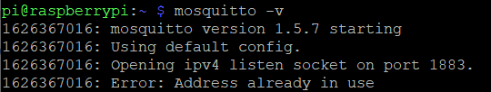
</center>

#### Raspberry Pi dirección IP Address y paquete Paho

Para utilizar el broker Mosquitto más adelante en sus proyectos, necesitará su dirección IP de Raspberry Pi. Para identificar su dirección IP de Raspberry Pi, escriba el siguiente comando en la ventana de su Terminal:
```
hostname -I
```
<center>
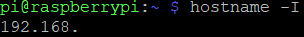
</center>

La libreria Paho proporciona una clase de cliente que permite que las aplicaciones se conecten a un broker MQTT para publicar mensajes, suscribirse a topics y recibir mensajes publicados. 
En este proyecto, el script de Python publicará mensajes en el broker para comunicarse con el Arduino Oplá Kit para encender y apagar los GPIO para controlar las luces y ejecutar un sonido.
Para instalar paho-mqtt ejecute el siguiente comando:

```
pip install paho-mqtt
```

También tienes que instalar la biblioteca Bluepy para tener comunicación con el Arduino Nicla Sense ME mediante Bluetooth: ​ 

Este repositorio https://github.com/IanHarvey/bluepy contiene los pasos para instalarlo en caso de problemas revisa las demas opciones yo segui la siguiente:

Necesite instalarlo desde la fuente.

```
sudo apt-get install git build-essential libglib2.0-dev
git clone https://github.com/IanHarvey/bluepy.git
cd bluepy
python setup.py build
sudo python setup.py install
```
Luego ejecute el comando:

```
pip install bluepy   
```

Con eso tenemos configurada la Raspberry Pi para conectar mediante python un dispositivo que no entrega informacion.

Para controlar el Robot Lego con el HAT compatible con Arduino necesitas instalar la biblioteca LegoPi para Raspberry Pi:
```
sudo pip3 install buildhat   
```

Es necesario instalar la biblioteca Python para Spotify y luego podrás controlar la música como desees con código: 
```
pip install spotipy --upgrade   
```

Y esos son los pasos que seguiremos para configurar nuestra Raspberry Pi.

Ahora veamos la configuración del IDE de Arduino.

### Setup Arduino IDE in Windows

Es hora de configurar todo en Windows (el sistema operativo que yo use) para entrenar el modelo y cargar los códigos en los tableros que vamos a usar: 

En primer lugar vamos a configurar el IDE de Arduino para las 3 placas utilizadas en el proyecto. Después de instalar el IDE de Arduino en su computadora 
es necesario instalar en el administrador de placas, las dependendencias necesarias para cada placa, aquí están los enlaces 
para ver la documentación de Arduino como guía de inicio rápido para cada placa. 

- [Nicla Sense ME](https://docs.arduino.cc/software/ide-v1/tutorials/getting-started/cores/arduino-mbed_nicla)
- [Arduino Oplá IoT Kit](https://opla.arduino.cc/?_gl=1*97vzvq*_ga*MjAwOTE1MTc1NS4xNjcyNDE0MTQx*_ga_NEXN8H46L5*MTY3NTA0MTA4NS43Ny4xLjE2NzUwNDEyNTcuMC4wLjA.)
- [Arduino Nano RP2040 Connect](https://docs.arduino.cc/software/ide-v1/tutorials/getting-started/cores/arduino-mbed_nano?_gl=1*j5d0ho*_ga*MjAwOTE1MTc1NS4xNjcyNDE0MTQx*_ga_NEXN8H46L5*MTY3NTA0MTA4NS43Ny4xLjE2NzUwNDEyNTcuMC4wLjA.)

También para el Arduino Nicla es necesario instalar la biblioteca Arduino_BHY2 de Arduino en el administrador de bibliotecas del IDE. 
Esta biblioteca permite utilizar todos los sensores de la placa. Para el Arduino Nicla es necesario instalar la biblioteca ArduinoBLE by Arduino en el administrador de bibliotecas del IDE. Esta biblioteca es para utilizar la conectividad Bluetooth en la placa.

Para la Placa RP2040 y el Kit Oplá IoT es necesario instalar la biblioteca WiFiNINA de Arduino en el gestor de bibliotecas del IDE. 
Este es para conectividad WIFI. Para la Placa Oplá IoT Kit es necesario instalar la biblioteca Arduino_MKRIoTCarrier de Arduino en el administrador de bibliotecas del IDE. Este es para el control del Carrier para las luces y sonidos con el timbre.

### Obteniendo la biblioteca MQTT para las placas Arduino
Para que Arduino Nano y Oplá interactúen con el broker de Raspberry es necesario instalar PubSubClient [libreria](https://github.com/knolleary/pubsubclient). 
Esta biblioteca proporciona un cliente para enviar mensajes simples de publicación/suscripción con un servidor que admite MQTT (básicamente permite que su Arduino hable con un Broker MQTT). 
[Click aqui para descargar la libreria PubSubClient](https://github.com/knolleary/pubsubclient/archive/master.zip)
1. Deberías tener una carpeta .zip en la carpeta de Descarga. Descomprime la carpeta .zip y deberías obtener la carpeta pubsubclient-master. 
2. Cambia el nombre de la carpeta de pubsubclient-master a pubsubclient.
3. Mueve la carpeta pubsubclient a la carpeta de bibliotecas de instalación de su IDE de Arduino. Luego, vuelve a abrir tu IDE de Arduino 
4. Finalmente tenemos todo configurado en nuestro IDE de Arduino y podemos comenzar a usar las placas, pero antes de hacerlo necesitamos configurar todo en nuestra máquina Windows para entrenar nuestro modelo con la plataforma Edge Impulse.

### Configuración de la CLI de Edge Impulse en Windows
Necesitas tener una cuenta en Edge Impulse. 
Para instalar Edge Impulse CLI en Windows, sigue la documentación detallada de [Edge Impulse](https://docs.edgeimpulse.com/docs/edge-impulse-cli/cli-installation). 
Ahora estamos listos para comenzar a entrenar nuestro modelo en caso de que quieras tener un modelo con movimientos diferentes a los míos, pero te mostraré cómo entreno mi modelo mas adelante aun faltan algunas configuraciones.

### Configurar Spotify en Raspberry

Primero necesitamos crear o iniciar sesión en el https://developer.spotify.com/ plataforma y lo primero que vamos a hacer es crear una aplicación que sea realmente sencilla, luego de esto vamos a tener en el Dashboard nuestra aplicación y tenemos que darle clic. Luego seremos redirigidos a la descripción general de la aplicación y tendremos que seleccionar editar configuración para agregar algunas URL: 

```
http://localhost:8888/callback   
http://localhost:8080  
```

Agregalas para redireccionar las URIs:

<center>
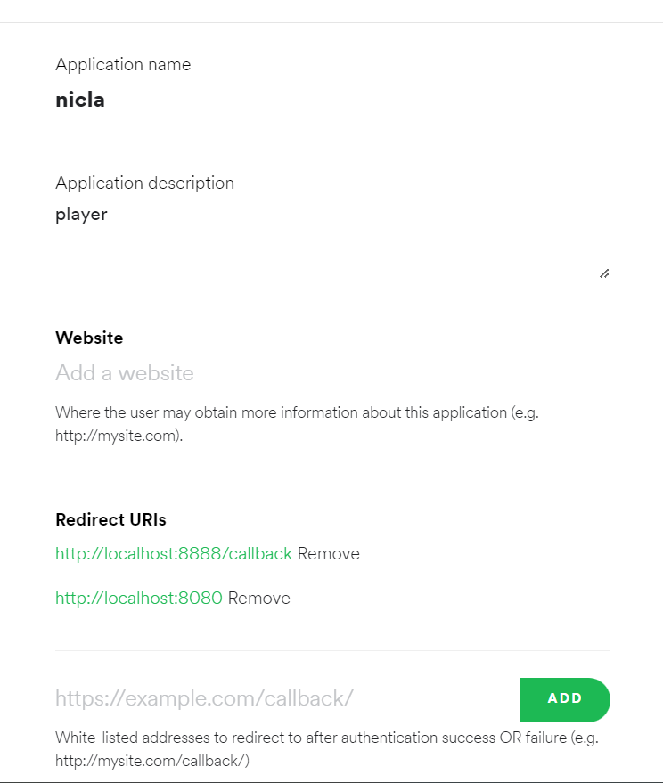
</center>

Después de agregarlos, volvemos a la descripción general de nuestra aplicación Nicla en el panel de desarrolladores, allí podemos encontrar el ID del cliente y el Client Secret que necesitamos para el código. Asegúrate de copiar los valores. Para obtener la ID del dispositivo, que es una pieza importante para nuestro código, necesitamos dos cosas: 
La más fácil es reproducir en cualquier dispositivo, teléfono, computadora, altavoz inteligente o cualquier otro dispositivo que queramos usar para escuchar música, reproducir cualquier lista de reproducción mientras. Al realizar este paso, necesitamos esto para detectar el dispositivo deseado y controlarlo a través de nuestro código Python. 
El segundo será ir a este enlace https://developer.spotify.com/console/get-users-available-devices/ en este enlace haremos clic en Obtener token, 
asegúrarse de marcar la casilla de verificación para user-read-playback-state y después de esto, haz clic en el token de solicitud.

<center>
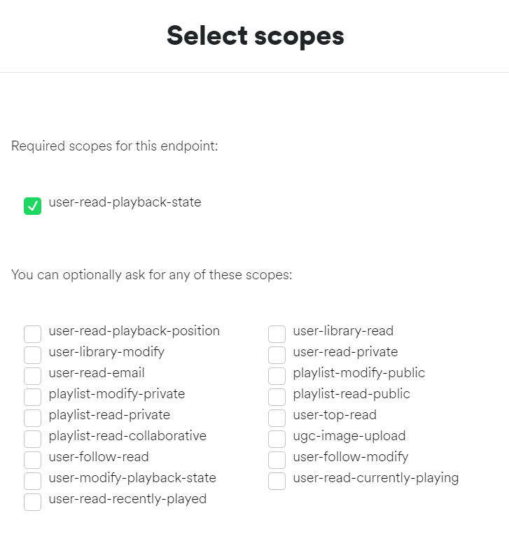
</center>

Haz clic en TRY IT y donde está el cuadro rojo en la imagen de abajo debería aparecer el "id": , ese es el valor que debes copiar, (no lo muestro porque es información sensible). 
Asegúrate de que el nombre corresponda a su teléfono o dispositivo utilizado.

<center>
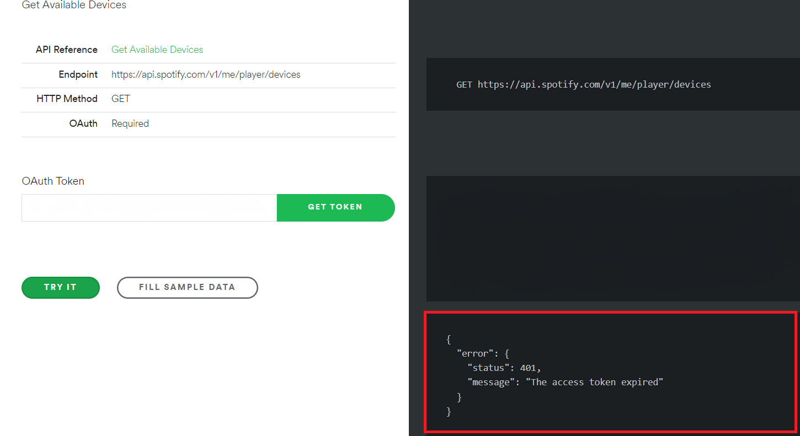
</center>

Ahora que tenemos todo preparado en la plataforma de Desarrolladores, debemos regresar a nuestra Raspberry Pi y abrir nuestro editor. Usé Thonny pero antes de usar nuestro código final necesitamos ejecutar un código anterior, solo para que Spotipy inicie sesión desde la Raspberry a nuestra cuenta de Spotify. 
Después de esto, el código ya no solicitará iniciar sesión ni solicitara credenciales en el dispositivo en el que estamos ejecutando nuestro código final. Una última cosa, si desea utilizar una canción específica, debe copiar el enlace de esa canción en Spotify. Opción en Spotify para copiar la canción como enlace. 

Aquí hay un ejemplo: 
https://open.spotify.com/track/**3h3XIdPa1W8NtxEw0TOQHb**si=cc4dd6b0ea0f41f6 
Entonces, en nuestro enlace marqué en negrita el código que debes copiar del enlace y reemplazar la última parte de esta línea código.

```
uris=['spotify:track:3h3XIdPa1W8NtxEw0TOQHb']
```

Ahora puedes reproducir desde tu código en Python cualquier canción que quieras. Copia, pega y ejecuta este código:

```
import spotipy   
from spotipy.oauth2 import SpotifyOAuth   
from pprint import pprint   
device_id = "" #Put the values from your account   
client_id = ""#Put the values from your account   
client_secret = ""   
redirect_uri = "http://localhost:8080"   
scope = "user-read-playback-state,user-modify-playback-state"   
sp = spotipy.Spotify(   
	       auth_manager=spotipy.SpotifyOAuth(   
	         client_id=client_id,   
	         client_secret=client_secret,   
	         redirect_uri=redirect_uri,       
	         scope=scope, open_browser=False))   
sp.start_playback(device_id=device_id ,uris=['spotify:track:1o7D1gLUgpFR3eJfIgpSUx'])   
```

Cuando ejecutas el código, proporciona un enlace en el que debes hacer clic y ahí es donde te pedirá que inicies sesión. El mismo enlace que envió debe copiarse y pegarse en un campo que te pide que pegues el enlace después de eso. Una vez todo configurado para usar Spotify con nuestro código final, continúa ejecutando el proyecto final. 

## Entrena el modelo en Edge Impulse

Seguí todos los pasos en los casos de estudio destacados proporcionados por Edge Impulse y el que trataba sobre el movimiento fue [Arduino x K-Way - Outdoor Activity Tracker](https://docs.edgeimpulse.com/experts/featured-case-studies/arduino-kway-outdoor-activity-tracker)
lo único que necesito incluir es antes de escribir el comando 
edge-impulse-data-forwarder, debes cargar el siguiente a tu Arduino Nicla. [Código](https://github.com/Zalmotek/edge-impulse-arduino-k-way-outdoor-activity-tracker/blob/main/arduino/components/nicla_sense_ingestion_climbing/nicla_sense_ingestion_climbing.ino) proporcionado por el caso de estudio.

Una vez que lo hayas hecho, y cuando escribas el comando edge-impulse-data-forwarder te preguntará el nombre de las variables, debes asegurarte de que coincidan, así que copia y pega esto en la terminal donde te pregunta los nombres de las variables. 
y solo sigue la documentación: 

```
accX, accY, accZ, gyrX, gyrY, gyrZ, rumbo, cabeceo, balanceo, rotX, rotY, rotZ, rotW   
```

Una vez que termines de diseñar tu modelo en la plataforma, debes ir a **Live Classification** y Datos de entrada con la función **Start Sampling** antes de ir a Prueba de modelo. 
Un consejo para usar una función que es realmente sorprendente de la plataforma Edge Impulse, es que te permite mapear las muestras que podrían tener errores en tu modelo, las marcadas en rojo en el **Feature explorer** son las que tal vez deberías eliminar del muestreo, y al seleccionarlos en el Explorador de funciones se mostrará el nombre para localizarlos y borrarlos tan fácilmente como hacer clic en los 3 puntos a la derecha de ese muestreo. 
Además, el **Feature explorer** te permite ver qué tan lejos están las muestras entre sí. Un buen modelo tiene un grupo de muestras para un movimiento alejados entre sí, al menos para este proyecto para tener un modelo que no confunda un movimiento con otro debe tener los grupos alejados entre sí. 
Después de que la prueba de su modelo tenga una precisión igual o superior al 90 %, puedes proceder a la implementación y exportar tu modelo como una biblioteca Arduino.

<center>
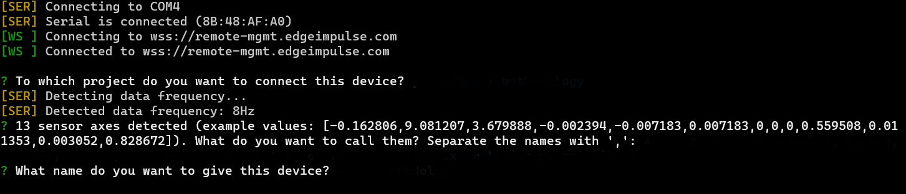
</center>

Ahora podemos exportar como biblioteca seleccionando la opción, entonces no es necesario seleccionar una placa para Nicla Sense ME y por favor seleccione la casilla para optimizar el modelo, se exportará y ahora podrá seguir los pasos para importarlo en Arduino IDE como una libreria. 
Y este es mi modelo en la plataforma Edge Impulse Studio que debes incluir en el IDE de Arduino como biblioteca. 

penduente
También puedes descargarlo como un archivo ZIP desde este [enlace](https://drive.google.com/file/d/1Xw_pMS1q8sWmX0Of4hZIFeWf8iHbAMMJ/view?usp=share_link). 
No olvides que necesitas los archivos de video para el proyector usados en este proyecto. Ve a este enlace para descargarlo y usarlo. 

<center>
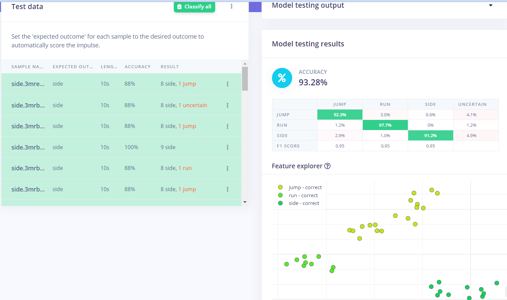
</center>

Ahora podemos ir a ejemplos, verificar la carpeta en la biblioteca con el nombre de nuestro modelo exportado desde Edge Impulse y seleccionar nicla_sense_fusion y ese es el archivo que vamos a modificar, pero primero debemos guardarlo como archivo para crear una copia. El ejemplo, ahora puedes probarlo para ver si los resultados son buenos y antes de probarlo, tenemos que borrar algunas líneas del ejemplo para nuestro modelo de movimiento, marca debajo de las líneas que debemos borrar.

<center>
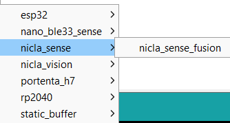
</center>

Borra las siguientes líneas para preparar nuestro script Arduino, extraen valores de sensores que no necesitamos para el modelo creado: 

```
/* Private variables ------------------------------------------------------- */
Sensor temp(SENSOR_ID_TEMP);
Sensor baro(SENSOR_ID_BARO);
Sensor hum(SENSOR_ID_HUM);
Sensor gas(SENSOR_ID_GAS);
static float get_temperature(void){return temp.value();}
static float get_barrometric_pressure(void){return baro.value();}
static float get_humidity(void){return hum.value();}
static float get_gas(void){return gas.value();}
/** Used sensors value function connected to label name */
"temperature", &get_temperature,
"barometer", &get_barrometric_pressure,
"humidity", &get_humidity,
"gas", &get_gas,
Void setup
temp.begin();
baro.begin();
hum.begin();
gas.begin();
```

Una vez que tengamos listo este archivo podemos guardarlo y comenzar a comentar unas líneas para centrarnos únicamente en el clasificador: 

```
//ei_printf("\nStarting inferencing in 2 seconds...\r\n");
//ei_printf("Sampling...\r\n");
// print the predictions
//ei_printf("Predictions (DSP: %d ms., Classification: %d ms., Anomaly: %d ms.):\r\n",
//result.timing.dsp, result.timing.classification, result.timing.anomaly);
//ei_printf("%s: %.5f\r\n", result.classification[ix].label, result.classification[ix].value);
```

La última modificación que haremos es agregar estas líneas en el bucle for que forma parte para imprimir las predicciones: 

<center>
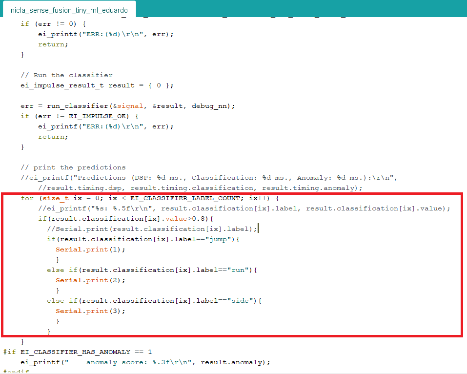
</center>

```
if(result.classification[ix].value>0.8){   
	         if(result.classification[ix].label=="jump"){   
	           Serial.print(1);   
	           }   
	         else if(result.classification[ix].label=="run"){   
	           Serial.print(2);   
	           }   
	         else if(result.classification[ix].label=="side"){   
	           Serial.print(3);   
	           }   
	         }   
```

Una vez que tengamos listo este archivo el Arduino se centrará en las salidas y podemos dejarlo como está, esto permitirá que Arduino comunique las salidas del modelo en el puerto serial. 
Esto significa que si conectamos el Arduino a nuestra Raspberry atraves de USB, podemos leer estos valores con un script de Python con salida de el siguiente comando.

```
model = ser.read()
```

Para verificar el puerto serial en Raspberry donde está conectado el Arduino escriba en la terminal **dmesg | grep -i tty** con ese puerto necesitamos copiar el nombre en caso de que utilicemos una comunicación en serie entre Nicla Sense ME y la Raspberry (esto es opcional, el objetivo de este proyecto es utilizar la comunicación Bluetooth). 
Pero estamos intentando que sea inalámbrico, por lo que este código que acabamos de modificar puede usarse como base para comenzar a mezclarlo con la biblioteca BLE que es compatible con la placa Arduino Nicla Sense Me. 
Al final encontrarás el código base de la Placa Nicla para comunicar el Arduino con la Raspberry usando Bluepy.

También puedes usar el código base para transmitir las variables para el modelo de forma inalámbrica, yo agregué un código base python usando Bluepy para recibir los datos y usarlos como base para cualquier proyecto, además la plataforma Edge Impulse te permite cargar las bases de datos simplemente asegurate de que sean del mismo formato compatibles para este proyecto.

### Código para el Kit Arduino Nano RP2040 y Oplá IoT

Puedes encontrar los códigos de cada placa al final pero es necesario crear un archivo .h para cada una con las credenciales de tu WiFi. 
En Arduino hay una opción hasta el botón de abrir monitor serie que si haces clic en ella aparecerá la función desplegable y una de ellas es crear una nueva pestaña, crea una con el nombre de secrets.h y luego pondrás estas líneas de código:

```
const char WIFI_PASS[] = ""; //Password of the network  
``` 

Esto es necesario para los archivos de todas las placas que van a hacer que se pueda conectar adecuadamente usando WiFi NiNa.

Una cosa extra para el kit Arduino Oplá IoT es repetir los mismos pasos y crear un archivo secrets.h uno para las credenciales y otro extra para la canción que incluye el buzzer en el Carrier, puedes crear tantas canciones como quieras, solo asegúrate de ponerlo en el formato correcto como este que usé con mi proyecto, ve a este [enlace](https://create.arduino.cc/editor/FT-CONTENT/37b7521c-325b-4868-b2c5-cf98cd2f0d45/preview?_gl=1*ml9iqj*_ga*MjAwOTE1MTc1NS4xNjcyNDE0MTQx*_ga_NEXN8H46L5*MTY3NTUzNDY1NS4xMDguMS4xNjc1NTM0ODI2LjAuMC4w) y copia el archivo pitches.h.

Tambien es necesario poner la dirección IP correspondiente a su broker en esta línea de código y hacer lo mismo para el Arduino Nano RP2040: 
```
IPAddress server(192, 168, 0, 0);
```

<!-- Y una última cosa que debo mencionar es que para cargar el código debes instalar y configurar PlatformIO con el código de Visual Studio, una vez que hayas hecho eso, carga el archivo Arduino BLE_model en Nicla Sense ME. Con esto estarás listo para utilizar el modelo de este proyecto con Bluetooth para enviar los resultados del clasificador a Python en Linux. ---->

También para cargar el código tienes que instalar la biblioteca BHY2 1.0.4 que es la versión que usé y que se ejecuta correctamente, luego tienes que ir a \libraries\Arduino_BHY2\src y buscar este archivo BoschSensortec.h, abrirlo y cambiar esto. 
valor:

```
#define WORK_BUFFER_SIZE    2048 
```
Cambiarlo por: 
```
#define WORK_BUFFER_SIZE    64   
```
Esto nos permite cargar apropiadamente nuestro modelo con la libreria BLE

## Workflow (Metodología) Run the code

Antes de ejecutar el código, me gustaría explicar cómo funciona. Repasemos el flujo de trabajo de Bluetooth. 
En el siguiente diagrama podemos ver que todo comienza con Nicla Sense Me usando el clasificador para detectar el movimiento, una vez hecho esto, lo enviará a través de Bluetooth a Raspberry, y el código Python tomará esta entrada para escribir finalmente en el broker la Acción que reproducirá los diferentes dispositivos y placas que se utilizan en el proyecto.

<center>
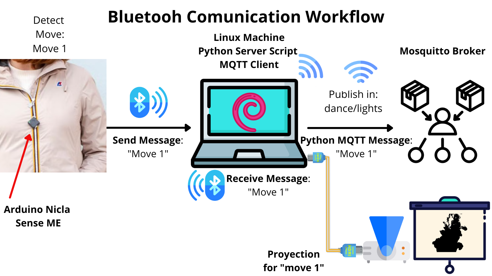
</center>

<center>
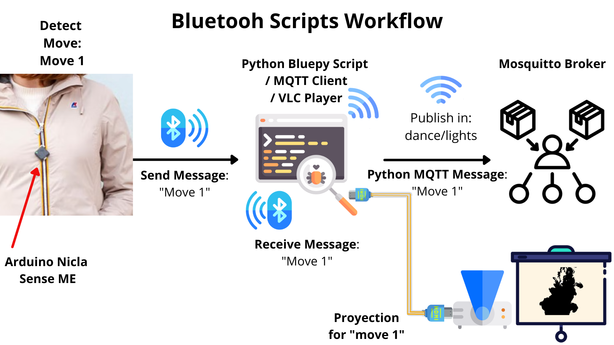
</center>

Ahora revisemos el flujo de trabajo MQTT que finaliza el proceso de este proyecto, después de recibir el mensaje en el broker, los Arduino se conectan, una vez que tienen alimentación, y se suscriben al mismo "canal" para recibir el mensaje sobre el movimiento recibido. 
Ejecutan las instrucciones preparadas para ese movimiento, como mencioné antes usé un robot Lego, pero puedes crear el tuyo propio dependiendo de los recursos que tengas, la música se puede reproducir con el Buzzer del Carrier, solo usando el dispositivo con Spotify o ambos.

<center>
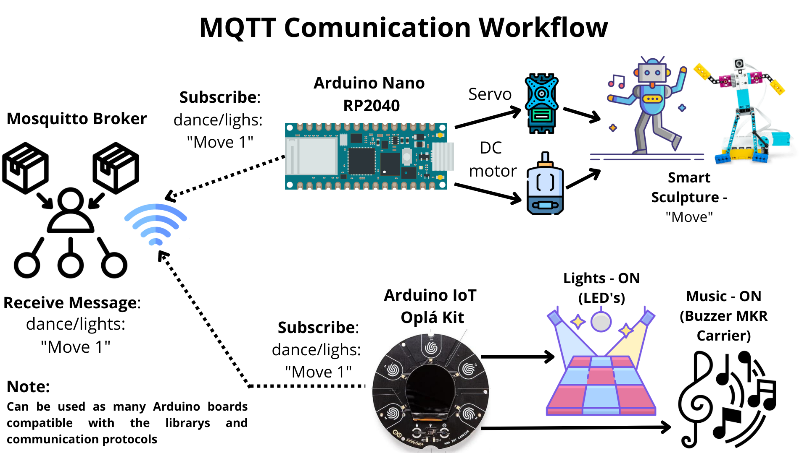
</center>

Una última cosa que me gustaría resaltar son las partes del código que puedes comentar en caso de que estés usando una opción diferente para el robot o no estés usando robot y hayas agregado otro elemento en el proyecto, así que si ese es el caso, por favor coment, borra o reemplaza las siguientes líneas:

```
from buildhat import Motor   
from buildhat import MotorPair   
right_arm = Motor('A') #define the port to connect the motor for the right arm   
left_arm = Motor('B')#define the port to connect the motor for the left arm   
def combo(): #movement of arms       
	   print("Run combo")       
	   right_arm.run_for_seconds(1.3, speed=-100)       
	   left_arm.run_for_seconds(1.3, speed=100)   
def back():#back to initial position       
	   print("Run back")       
	   right_arm.run_for_seconds(1.3, speed=100)        
	   left_arm.run_for_seconds(1.3, speed=-100)   
def both():#move arms at same time        
	   print("Run both")        
	   right_arm.run_for_seconds(3, speed=-100, blocking=False)        
	   left_arm.run_for_seconds(3, speed=100, blocking=False)   
def backb():#move back arms at same time        
	   print("Run backb")        
	   right_arm.run_for_seconds(3, speed=100, blocking=False)        
	   left_arm.run_for_seconds(3, speed=-100, blocking=False)   
#<----> in the if's there is a for for each one to move the motors of the LegoPi depending on the move   
#Comment all the for's in case you are not using Lego   
	   #for to move twice the robot arms       
	   combo()       
	   sleep(0.5)       
	   back()      
	   sleep(0.5)   
```

Y también cambia la dirección IP para esta línea de código, poniendo la IP correspondiente a la Raspberry.

```
broker_address = "192.168.xx.x" #put the ip from Raspberry as broker_address
```
Otro cambio en el codigo que debes hacer es cambiar la dirección MAC para la comunicación Bluetooth entre los dispositivos, así que ve al archivo Python en la última parte del código y cambia la dirección de tu placa. 
Hay dos formas de hacerlo, una es con el archivo scanner.py adjunto en este repo es necesario para ejecutarlo desde la terminal en Raspberry, le mostrará los dispositivos disponibles y el otro es abrir el monitor serie en Arduino una vez que cargue el código en Nicla de esta manera:

<center>
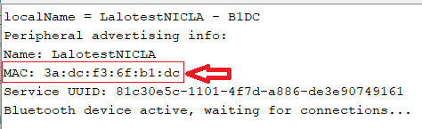
</center>


Copia y pega el valor en la siguiente línea:

```
p = btle.Peripheral("1a:b4:c0:25:3a:aa")#use the scanner.py file to obtain this BLE address for the NICLA
```
Además, una última edición de nuestro código es la ruta del directorio de nuestros archivos multimedia que se van a reproducir. Edita o comenta estas líneas dependiendo de si las va a utilizar o no. 

```
player= vlc.MediaPlayer('/home/pi/Desktop/media/model4/ink4.mp4') #CHANGE DIRECTORY 
```

Ahora que tenemos una idea clara sobre el proyecto completo, podemos ejecutar el código.

## Mapping, iluminación y esculturas inteligentes Script Running

El script es la base de interacción del usuario con mapeo, música, iluminación y escultura durante los movimientos realizados. El script ha sido desarrollado íntegramente con Python además de una integración de VLC, Spotify y MQTT, para una interacción más intuitiva y sincrónica. 
El script sirve como reproductor en tiempo real, activación de luces, sonidos y esculturas a través del modelo entrenado que se despliega en el Arduino Nicla Sense ME, el cual envía los datos por Bluetooth o conexión serial a un kit Oplá IoT y Arduino Nano RP2040 Connect. 
Placa Arduino inalámbrica utilizando el corredor MQTT como elemento de traductor entre el usuario y el modelo. Si los archivos de media son diferenrtes a videos, será necesario cambiar la ruta y el nombre del archivo. 

Podemos ejecutar el script para reproducir la animación en el proyector y activar las luces como predice el modelo implementado(**antes de ejecutar el script, asegúrese de que la ruta en la condición del script sea correcta**).

[](https://youtu.be/_X0TFTJeD0U?feature=shared)


Nota: Lo hice por separado ya que el proyector es prestado y no me dio tiempo de probar todos los elementos juntos, ya que pensé que el robot no se apreciaría en el video con poca iluminación. 
El script que sirve de interfaz entre Raspberry, Arduino y los elementos utilizados es capaz de imprimir el estado del reproductor VLC así como la conexión MQTT no necesita conexión a internet, solo conectado al mismo router al que está conectado el Oplá. 
La tarjeta Arduino Nano también pueden funcionar en un hotspot de un teléfono inteligente. 
En general, la CPU del script podria requerir más potencia si hay muchas ventanas de VLC abiertas, así que agrego una condición relacionada con el estado del reproductor para que cuando termine la animación, el reproductor se cierre para reducir el uso de la CPU y evitar el uso innecesario de la CPU.
Ahora veamos un vídeo de cómo funciona todo junto.

[](https://youtu.be/FAeuIUkGI3k?feature=shared)


Este fue mi proyecto con todos los recursos que tengo pero puede servir como base para crear algo más grande. Me imagino algo como esto:

<center>

</center>

<center>
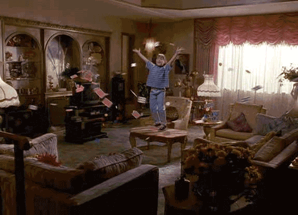
</center>

## Desafíos con los que me encontré y lo que aprendí
- El principal desafío (una vez que aprendí a crear el modelo con Edge Impulse) fue crear conexiones bluetooth sin tener mucho conocimiento sobre la biblioteca BLE, que usé antes para otros proyectos de riego conexión WiFi usando la base de datos en tiempo real Firebase y MQTT. Es por eso que descubrí que Mosquitto y Paho en Debian pueden resultar en las tecnologías más adecuadas para abordar la conexión inalámbrica, de modo que pueda obtener control en tiempo real. Pero durante el desarrollo de este proyecto aprendí mucho sobre Arduino Cloud y las conexiones con diferentes placas.
Observaciones sobre el proyecto
- La conexión Bluetooth tiene un número limitado de dispositivos para conectar en Debian, solo permite 7 dispositivos usando bluetooth. Windows tiene 10 dispositivos, por lo que con muchos usuarios será difícil usar bluetooth. Las recomendaciones utilizarán otro protocolo de comunicación.
- Entrenar los movimientos puede ser difícil haciendo más de 20 repeticiones de un movimiento, además me doy cuenta de que grabar los movimientos, es necesario ser muy preciso al realizar los movimientos, la diferencia en cada repetición afecta la precisión del modelo. Para tener una base fuerte para el modelo la recomendación es tener al menos 20 repeticiones de cada movimiento y 10 al menos para la prueba del modelo en la plataforma Edge Impulse. Además, después de 3 movimientos podemos encontrarnos con problemas como clasificación errónea. Después de 3 movimientos, tenemos que ser muy creativos para hacer los movimientos lo menos similares posible en términos de variables, especialmente con el acelerómetro y el giroscopio.

## Logros de los que estoy orgulloso

- Crear un script personalizado para cambiar solo algunas variables
- Envío de datos usando la biblioteca BLE a mi dispositivo Linux usando Python
- Envío de mensajes a un Arduino Nano y Arduino MRK1010 usando MQTT
- Aprendiendo nuevas tecnologías en un tiempo récord
- Comience a crear una herramienta que ayudará a otros

## ¿Qué sigue para el proyecto?

- Desarrollar su propio dispositivo integrado para la implementación del modelo (que ya debería incluir un acelerómetro, giroscopio y una conexión wifi)
- Mejorar la adquisición de datos del usuario a través del acelerómetro y giroscopio.
- Agregue grabación Bluetooth de todas las variables utilizadas en este proyecto y hágalas compatibles con la plataforma Edge Impulse.
- Implementar en un museo, o presentación de arte (también en mi casa para futuros proyectos)
- Agregue esculturas cinéticas con impresión 3D usando servomotores y motores DC para agregar un efecto como el de la película Matilda.
- Prototipo de prueba con bailarina.
- Agrega efectos mágicos y agrega más efectos visuales con las animaciones.

